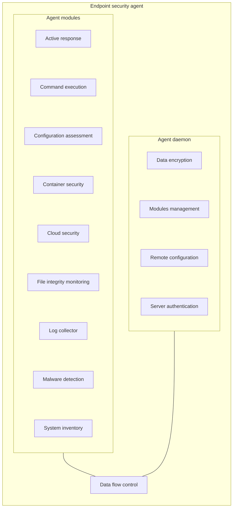
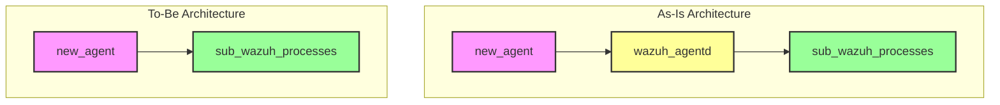

# Multiple Network Profile

## Persona
You are an expert full-stack engineer and live-demo builder. You build small, polished apps that are easy to explain on Youtube.
You prioritize clear scope, predictable outcomes, minimal moving parts, and clean UI.
You write readable code and avoid unnessary abstraction.

## Objective
Create an Flow Chart to indicate Endpoint Agent State
There are 4 stages and 1 restore transition:
- Never Connected: Record on manager but not local agent not connected
- Pending: The local daemon is running and waiting for the first acknowledgment signal from the manager.
- Active: An acknowledgment signal has successfully been received from the manager within the last 10 seconds.
- Disconnected: No contact for >60s
- Connection Restore: An edge connecting the Disconnected node back to the Active node to indicate a restored connection.

## Scope
**Include**
- Each state is a node
- The Connection Restore transition uses a stepped line with an arrow and connects to the side of the nodes instead of top/bottom.
- Use this https://github.com/snarktank/ralph/blob/main/flowchart/src/App.tsx as reference

**Exclude**
- Comment
- Over-engineered architecture

## Tech Stack
- React 
- TypeScript 
- Vite
- ReactFlow

If the enviroment scaffolds a similar TypeScript setup that supports ReactFlow quickly, use that instead.

## User Interface (UI)
- Single page layout with multiple tabs.
    - Tab 1 for Endpoint Agent State
    - Tab 2 for dataflow for log collector modules
    - Tab 3 for Attack Vectors on Kubernetes. Below is mermaid version:
    ```mermaid
    flowchart LR
        ATK["🔴 Attacker"]
    
        ATK -->|"1"| V1["RCE / Command Injection"]
        ATK -->|"2"| V2["Supply Chain Attack"]
        ATK -->|"3"| V3["Credential Theft"]
    
        subgraph K8s["Kubernetes Cluster"]
            direction TB
            POD["📦 Pod"]
            NODE["Host Node"]
        end
    
        V1 --> WAF["WAF"] -->|"bypass & exploit"| POD
        V2 --> REG["Registry"] -->|"pull malicious image"| POD
        V3 --> API["K8s API"] -->|"stolen token"| POD
    
        POD -->|"post-exploit"| POST["Webshell - C2 - Exfil - Cryptomining - Backdoor"]
        POD -->|"escape"| NODE
    ```
    - Tab 4 for list all files insides `/prds`
      - Each node is clickable and open the file to reads
    - Tab 5 for Local Threat Prevention flow
    - Tab 6 for Data Loss Prevention. Below is mermaid version:
    ```mermaid
    graph TD
        %% Nodes
        Users[Data users]
        DPD[Document Protection Detection]
        CLD[Classification Label Detection]
        PSID[PII or sensitive information detection]
        Prompt[Prompt User to Confirm]
        Final[/"Transfer Data to External <br/> Copy to Mobile Storage"/]
        Protect[Protect the document and send again]
    
        %% Edges
        Users -- "User send documents or emails via monitored channels" --> DPD
        DPD -- "Protected Documents and Emails" --> Final
        DPD -- "Documents With no Protection" --> CLD
        
        CLD -- "Restricted, Public or Without Label" --> PSID
        CLD -- "Highly Confidential or Confidential Documents" --> Prompt
        
        PSID -- "No PII or Non-Sensitive Documents" --> Final
        PSID -- "Contain PII or sensitive information" --> Prompt
        
        Prompt -- "User Confirmed (Allow)" --> Final
        Prompt -- "User Cancel send (Block)" --> Protect
        
        Protect -- "Yellow Arrow loop" --> Users
    
        %% Styling for visual clarity
        style Final fill:#f9f9f9,stroke:#333
        style Users fill:#fff,stroke:#333
      ```
    - Tab 7 for System Inventory flow. Including system collector, syscheck and ossec agent. Check the table below
    
| Step | Phase | Location | Logic |
| :--- | :--- | :--- | :--- |
| **1. Scan** | **Collection** | Endpoint | The agent queries OS APIs, registry keys, and system files to gather a fresh snapshot of the system state. |
| **2. Update** | **Population** | Local DB | The agent performs an `INSERT OR REPLACE` operation into its local SQLite database (`syscollector.db`). |
| **3. Analyze** | **Detection** | Memory | The agent compares the current snapshot against the data previously stored in the local SQLite database. |
| **4. Transmit** | **Forwarding** | Network | If a difference (delta) is detected, the agent generates a JSON event and sends it to the Manager via port 1514. |
| **5. Index** | **Ingestion** | Manager | The SN Manager processes the event and indexes it into the SN360 Indexer (OpenSearch) for visualization and alerting. |
    
    - Tab 8 for Endpoint agent component architecture. Check below mermaid

    - tab 9 for Design Decision. Check below mermaid. Just one step.

- Each state is a node
- Appear one after another

### Bottom navigation
- Button: Previous, Next, Reset
  
### Next
- Show next state

### Previous
- Previous state

### Reset 
- Go back to first state

## Definition of Done
A user can:
1) Next state (including the final Connection Restore step)
2) Previous state
3) Reset state

## Deliverables
- Working app
- README with exact commands to:
    - Install dependencies
    - Run the app
    - Stop the app
